# ESP32 FreeRTOS Environmental Monitor

A multi-sensor environmental monitor running on FreeRTOS. The ESP32 runs four concurrent tasks that independently read sensors, update an OLED display, serve a live web dashboard, and monitor system health via a watchdog. Demonstrates concurrent embedded programming beyond single-loop Arduino code.

---

## Demo Video

https://github.com/JadenS180/esp32-rtos-monitor/raw/main/media/rtos_demo.MOV

---

## Photos

### Full Build
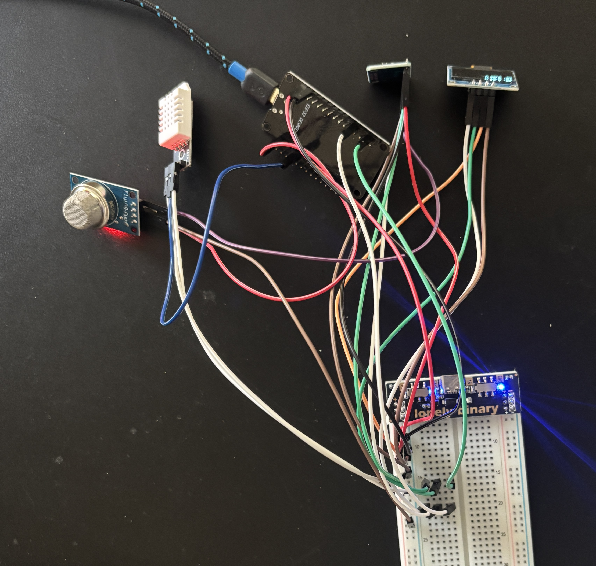
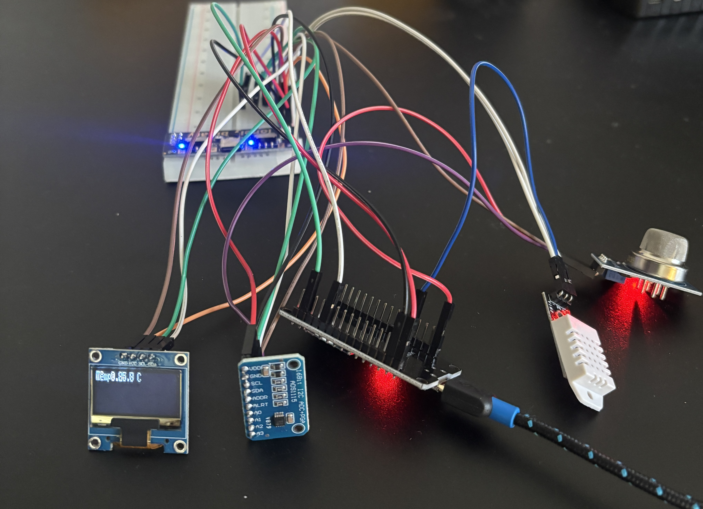
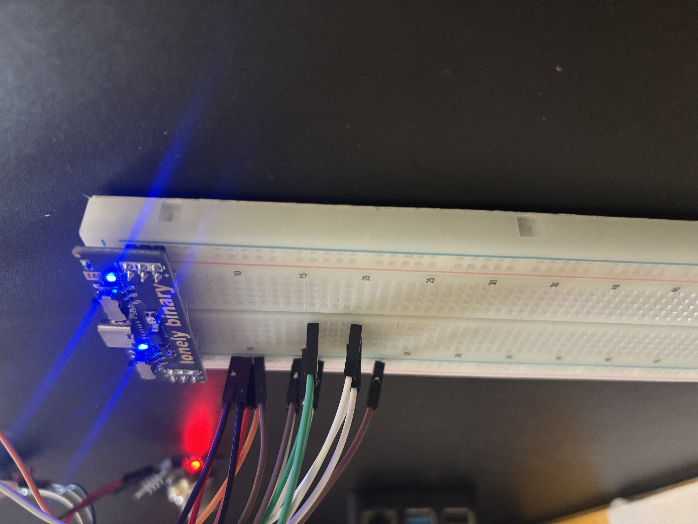
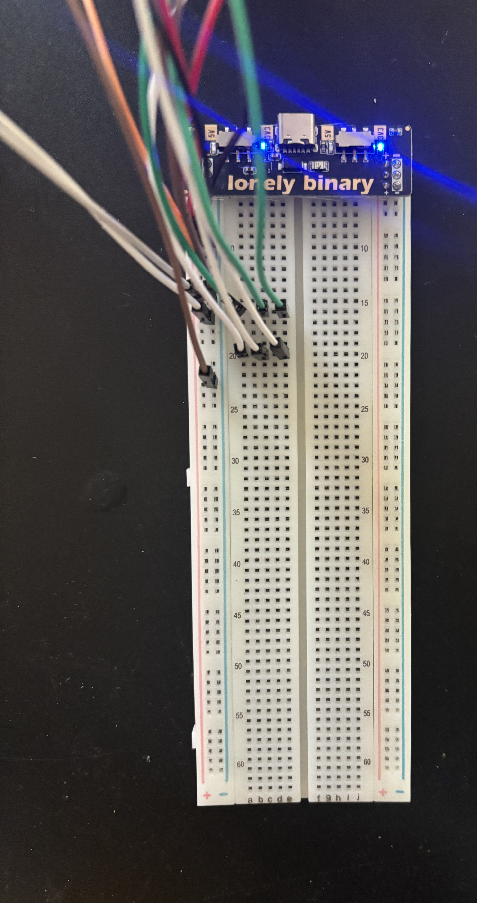

### Components
| | |
|---|---|
| 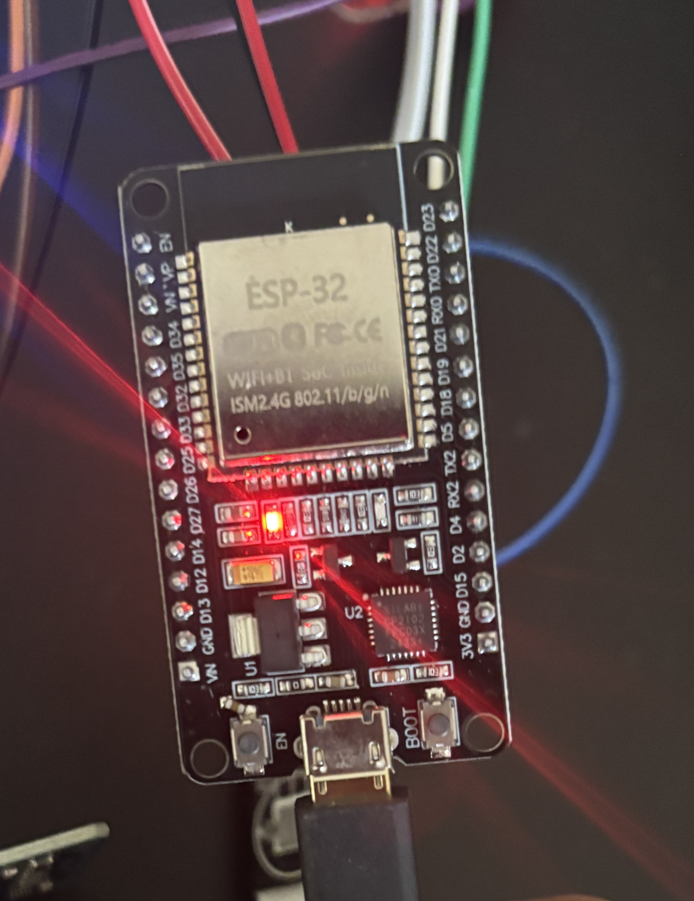 | 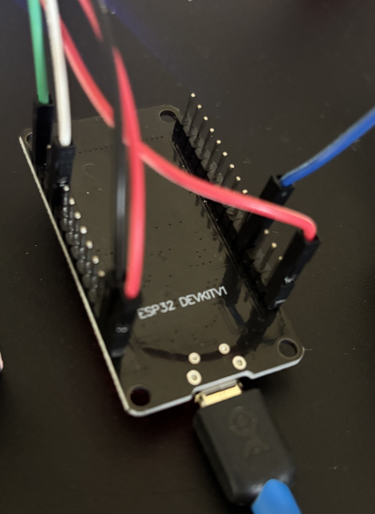 |
| ESP32 (front) | ESP32 (back) |
| 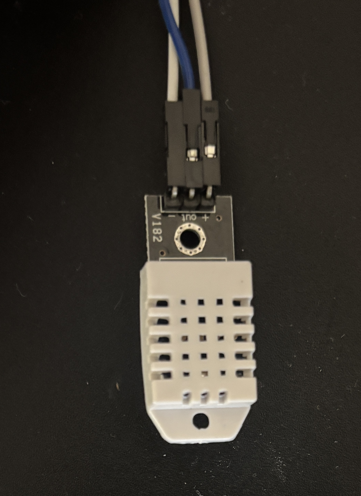 | 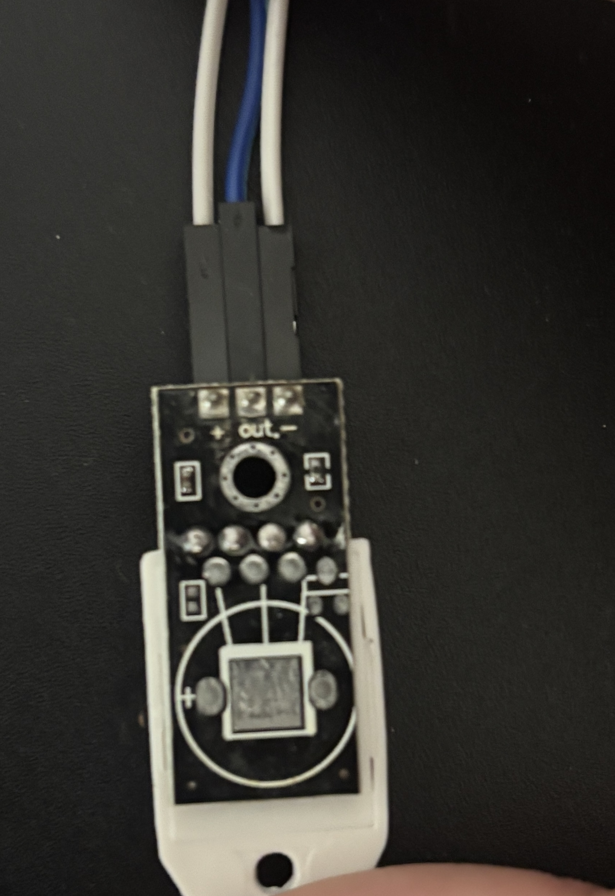 |
| DHT22 (front) | DHT22 (back) |
| 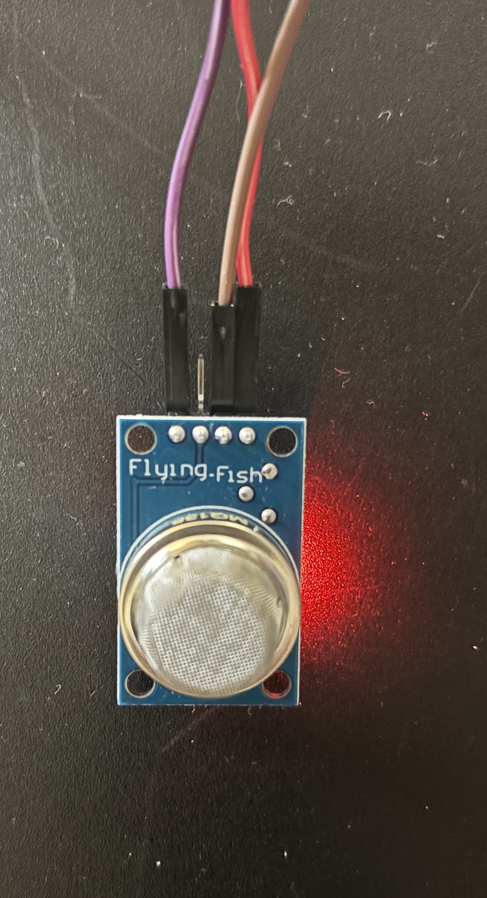 | 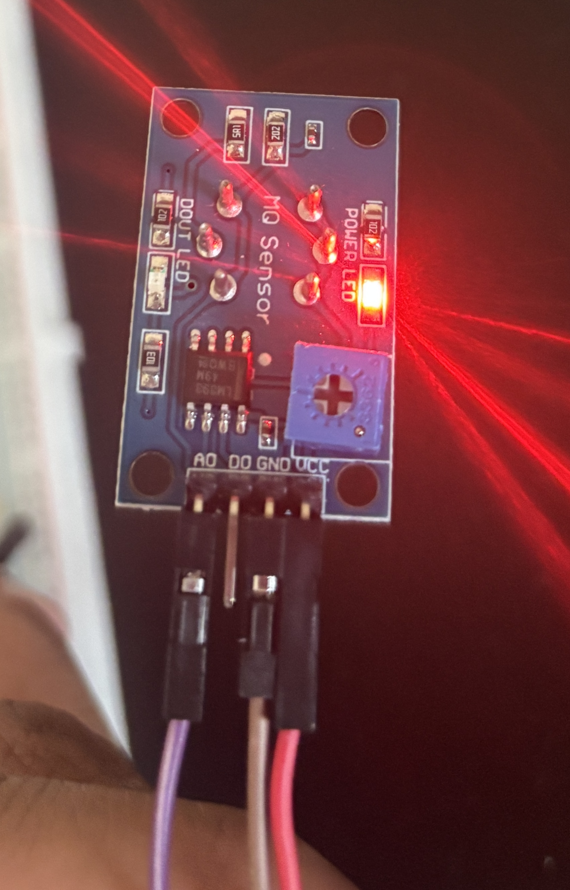 |
| MQ-135 (front) | MQ-135 (back) |
| 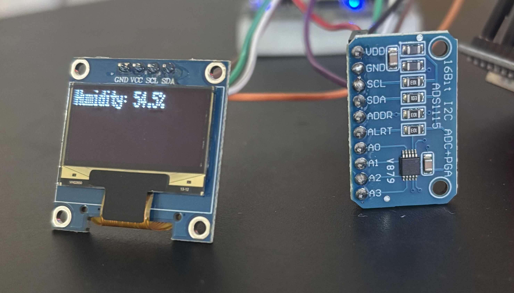 | 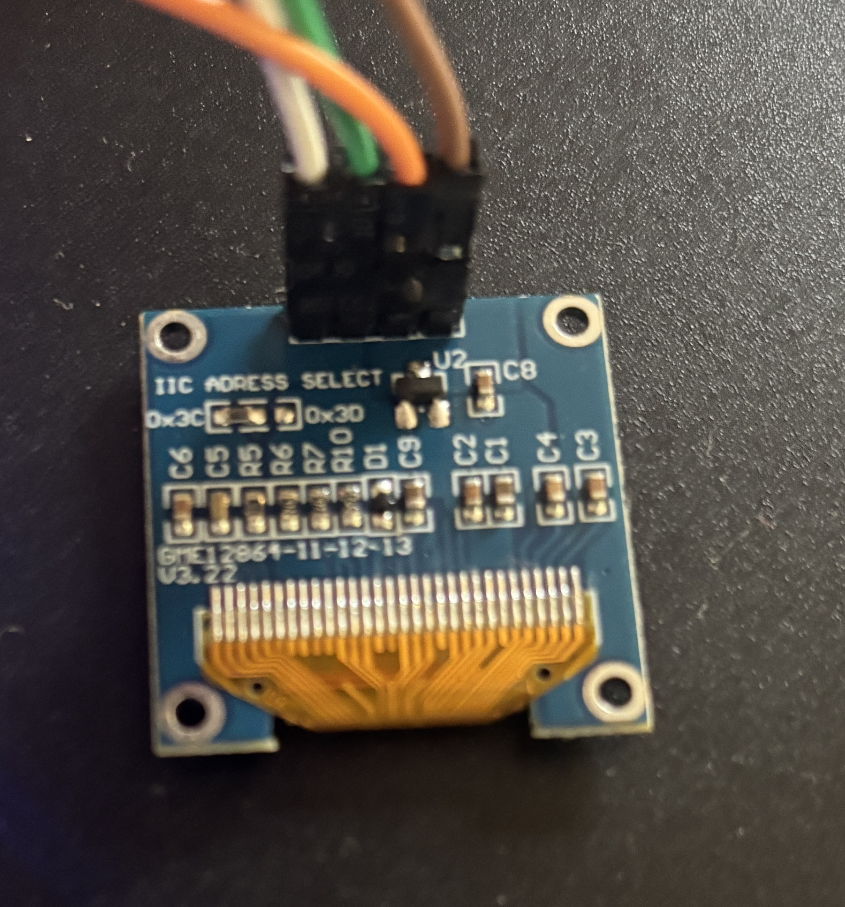 |
| SSD1306 OLED and ADS1115 | OLED (back) |

---

## Features

- Four concurrent FreeRTOS tasks with independent priorities
- DHT22 temperature and humidity sensing
- MQ-135 air quality sensing via ADS1115 ADC
- SSD1306 OLED display cycling through sensor readings
- Live web dashboard served directly from the ESP32 over WiFi
- Watchdog task that auto-restarts the system if any task hangs

---

## FreeRTOS Task Structure

| Task | Priority | Function |
|---|---|---|
| Sensor Task | 3 (highest) | Reads DHT22 and ADS1115 every 2 seconds, pushes to queue |
| Display Task | 2 | Pulls from queue, cycles OLED through temp/humidity/AQ |
| Server Task | 1 | Handles incoming web requests, serves live dashboard |
| Watchdog Task | 1 | Monitors all tasks every 10 seconds, restarts if any hang |

---

## Hardware

| Component | Description |
|---|---|
| ESP32 Dev Board | Microcontroller |
| DHT22 | Temperature and humidity sensor |
| MQ-135 | Air quality sensor |
| ADS1115 | 16-bit I2C ADC for MQ-135 analog output |
| SSD1306 | 0.91" I2C OLED display (128x32) |

### Pin Mapping

| Component | Pin |
|---|---|
| DHT22 DATA | GPIO 14 |
| ADS1115 SDA | GPIO 21 |
| ADS1115 SCL | GPIO 22 |
| OLED SDA | GPIO 21 |
| OLED SCL | GPIO 22 |
| MQ-135 AOUT | ADS1115 A0 |

---

## Firmware

Written in Arduino C++ using the Espressif ESP32 package (v3.3.10). FreeRTOS is built into the ESP32 Arduino core.

**Dependencies:**
- [DHT sensor library for ESPx](https://github.com/beegee-tokyo/DHTesp)
- [Adafruit ADS1X15](https://github.com/adafruit/Adafruit_ADS1X15)
- [Adafruit SSD1306](https://github.com/adafruit/Adafruit_SSD1306)
- [Adafruit GFX Library](https://github.com/adafruit/Adafruit-GFX-Library)
- [ArduinoJson](https://github.com/bblanchon/ArduinoJson)

**To flash:**
1. Open firmware/esp32-rtos-monitor.ino in Arduino IDE
2. Set your WiFi credentials in the firmware
3. Select board: ESP32 Dev Module under Espressif Systems
4. Connect ESP32 via USB and upload

---

## Web Dashboard

Once the ESP32 is powered and connected to WiFi, open a browser and navigate to the ESP32's IP address shown on the OLED at boot. The dashboard auto-refreshes every 3 seconds showing live temperature, humidity, and air quality readings.

---

## Repository Structure

\`\`\`
esp32-rtos-monitor/
├── firmware/
│   └── esp32-rtos-monitor.ino
├── media/
│   ├── (photos)
│   └── (videos)
└── README.md
\`\`\`

---

## Author

Jaden Smiles — [github.com/JadenS180](https://github.com/JadenS180)
